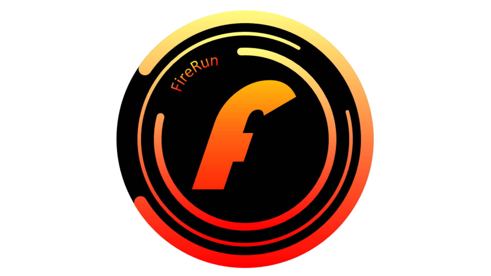

# 안녕하세요! 파이어런입니다!  
---
- 엔트리 유저 
- 카테고기 변경 코드 **2**번째 발견자(?)
- 엔트리 취약점(xxs) 2개 발견한 유저(?) / **( 엔트리 오브젝트 이름으로 하는 xxs는 제가 발견한게 아닙니다 )**
- 프로필 제작자 : 엔에이(NA)
- 이메일 [entry@firerun.kro.kr](mailto:entry@firerun.kro.kr)
- 거주 : 대전광역시
- ~~허니츄러스 팬 이름 과메기단, 허니비중 허니비를 지지하고 있습니다~~
- 엔트리 작품중 운영자 방문 작품 존재! ~~자랑~~
- 성별 : 남자

  ## 사용중인 IDE(또는 IDE 비슷한거)
  - vscode [(설치)](https://code.visualstudio.com/) [(웹버전)](https://vscode.dev) | 확장에서 python설치하면 pythonIDE완성(?)
  - [replit](http://replit.com) | 메인으로 사용
  - [구름IDE](https://www.goorm.io/) | 자주 사용을 안하고 있음
  - ~~[VS2022](https://visualstudio.microsoft.com/)~~ | 현재 사용을 안하고 있음
  - ~~[윈도우 메모장](https://apps.microsoft.com/store/detail/windows-notepad/9MSMLRH6LZF3)~~ | 이상한 소리 하지 말라고요? 알겠습니다
  - ~~[파이썬 기본](https://python.org/)~~ | 누가 쓸까요(?)
  - ~~[유니티](https://unity.com/)~~ | 현재 사용을 하지 안하고 있음
  - [파이참](https://jetbrains.com/ko-kr/pycharm/) | 코딩학원에서 사용

  ## ~~프로필 사진(?)~~
  

  ## 그냥 생각나는 단어를 쓰다보면 뭐가 나오겠죠 그냥 이렇게만 쳐도 제목은 완성이 안될껍니다 전 또 뭔 헛소리를 하는걸까요 궁금하네요 인간이 가장큰 공포를 느끼지못한다는 글쓰기 

  언어 | 상태
  ---- | --
  한국어🇰🇷 | 거의 완:star:벽
  영어🇺🇸 | ~~몰?루~~
  엔트리 | ~~초보(?)~~
  html | ~~곧 배울 수도요(?)~~
  python | 배우는중...
  Javascript | ~~곧 배울껍니다(?)~~
  
# 다른 유저와의 관계
유저 | 관계
--- | ---
엔에이님 | 지금의 제 프로필을 만들어주신 멋진분!
김잔상님 | ent2 리뉴얼 후 버전 개발하신분, 하지만 엔트리의 취약점을 악용하시지만 ~~저는 안당했으니 상관없는분!~~
냠냠이 | 쓸꺼없어서 적은거에요 이해해주세요

# 진짜 리얼 깃허브 정보들

## 사용 언어/소셜/프로그램
          <a here="https://daringfireball.net/">                  
---
**착각하지마세요, 여기는 제 위키라 아니라 깃허브 소개입니다!**
